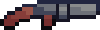

# Shoot clash


Jeu de tir et de plateformes créé pour un projet scolaire.

## Installation
Le jeu utilise [Poetry](https://python-poetry.org/) pour la gestion des dépendances. Il est recommandé de l'installer, mais installer manuellement `pygame` devrait aussi fonctionner.

Pour démarrer le jeu, il faut lancer le fichier `run.py` à la racine.
```
$ poetry install && poetry shell  # Si vous utilisez Poetry, sinon `pip install pygame`
$ python run.py
```

## Instructions
Le personnage doit détruire tous les ennemis et se rendre sur la porte pour terminer la partie. Les ennemis apparaissent progressivement.

Le personnage se déplace avec les touches `Flèche gauche` et `Flèche droite`. Il peut sauter en appuyant sur `Flèche haut`. Pour tirer, il faut utiliser la touche `Espace` (on peut rester appuyé pour tirer en continu).

### Système de rechargement
Le jeu comporte un système de rechargement pour empêcher le joueur de tirer en continu. L'état du rechargement est affiché au dessus du joueur, sous la barre de vie.

La barre augmente lorsque le joueur tire. Tant qu'elle est blanche, le joueur peut tirer.


Si la barre atteint sa taille maximale, elle devient rouge et le joueur doit attendre qu'elle diminue pour tirer à nouveau.


La barre de rechargement commence à descendre automatiquement après une seconde si on ne tire pas. Le temps pour qu'elle diminue entièrement dépend de l'arme choisie.

### Choix des armes
Le joueur peut choisir une arme au début de la partie avec les flèches de droite et de gauche du clavier. Chaque arme a des caractéristiques différentes :

 : Fusil à cadence rapide et dégats faibles

 : Pistolet à cadence lente et dégats élevés

## Capture d'écran du jeu


## Licence
Le jeu est disponible sous licence [ISC](LICENSE), ce qui signifie que vous pouvez le redistribuer librement. Consultez le dossier `/assets` pour les licences des images et sons utilisés.
